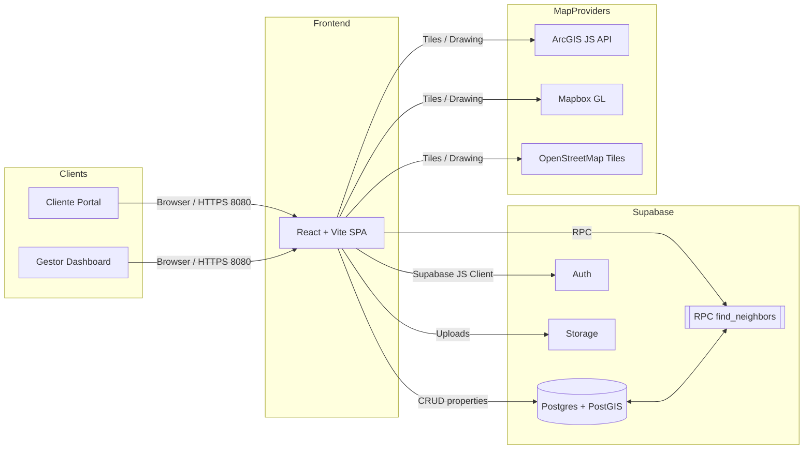
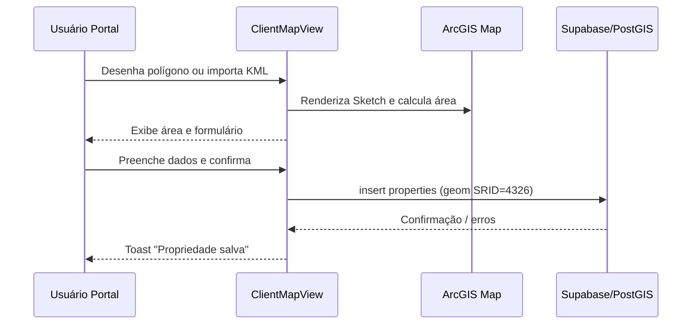
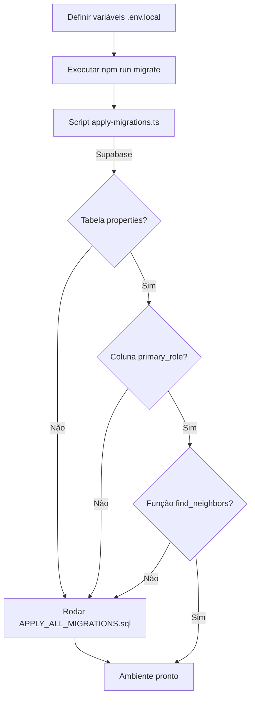
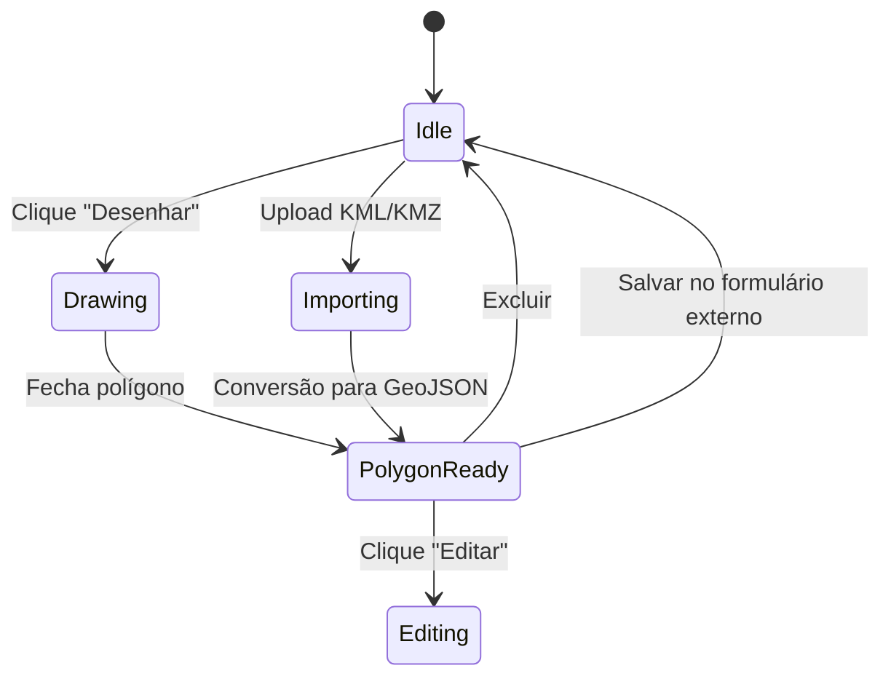

# Núcleo Regulariza GO

> Plataforma completa para regularização fundiária: cadastre propriedades, integre clientes e gestores, monitore casos, colete documentos e visualize mapas interativos com análises espaciais.

---

## 📚 Sumário

1. [Visão geral](#-visão-geral)
2. [Funcionalidades principais](#-funcionalidades-principais)
3. [Arquitetura e tecnologias](#-arquitetura-e-tecnologias)
4. [Diagramas orientativos](#-diagramas-orientativos)
5. [Estrutura de pastas](#-estrutura-de-pastas)
6. [Rotas e fluxos do usuário](#-rotas-e-fluxos-do-usuário)
7. [Configuração do ambiente](#-configuração-do-ambiente)
8. [Variáveis de ambiente](#-variáveis-de-ambiente)
9. [Scripts disponíveis](#-scripts-disponíveis)
10. [Processos e notas técnicas](#-processos-e-notas-técnicas)
11. [Banco de dados e PostGIS](#-banco-de-dados-e-postgis)
12. [Integrações externas](#-integrações-externas)
13. [Qualidade, testes e monitoramento](#-qualidade-testes-e-monitoramento)
14. [Troubleshooting rápido](#-troubleshooting-rápido)
15. [Deploy e operação](#-deploy-e-operação)
16. [Roadmap sugerido](#-roadmap-sugerido)
17. [Contribuindo](#-contribuindo)
18. [Créditos](#-créditos)

---

## 🔎 Visão geral

**Núcleo Regulariza GO** combina um dashboard administrativo, um portal guiado para clientes e visões de mapa para análise territorial. O frontend (`React + TypeScript + Vite`) comunica-se com o backend gerenciado do **Supabase**, que fornece banco PostgreSQL com PostGIS, autenticação e políticas RLS. O módulo de mapas utiliza ArcGIS API, Mapbox GL e OpenStreetMap para desenho de croquis, cálculo de área e análise de vizinhança.

Principais pilares:

- Controle completo do ciclo de vida de casos (captura → revisão → entrega)
- Portal colaborativo para clientes enviarem documentos, responderem questionários e desenharem perímetros
- Visualizações espaciais para gestores (mapa de oportunidades, vizinhos, heatmaps)
- Base de dados geoespacial (PostGIS) com políticas de segurança (RLS) e funções especializadas (`find_neighbors`).

---

## 🚀 Funcionalidades principais

### Para Clientes
- Cadastro guiado de casos via portal (`/portal/:caseId/*`)
- Desenho do perímetro em mapa (ArcGIS + Mapbox) e upload de arquivos KML/KMZ
- Questionários customizados e checklist documental
- Acompanhamento do status e revisões em tempo real

### Para Gestores e Equipe Técnica
- Painel `/dashboard` com indicadores e atalhos
- Gestão de casos (`/dashboard/cases`, `/dashboard/cases/:caseId`)
- Biblioteca de templates e automações (`/dashboard/templates`, `/dashboard/exports`)
- Mapa completo com filtros por município e objetivo (`/gestor-map-view`)
- Controle de clientes, pendências e configurações do workspace

### Operações Internas
- Integração com Supabase Auth (controle de acesso) e Papéis (`GESTOR`, `CLIENTE`)
- Análises espaciais (confrontantes, distâncias) com `find_neighbors`
- Notificações em tempo real (`useNotifications`, toasts duplos Shadcn + Sonner)

---

## 🧰 Arquitetura e tecnologias

| Camada | Tecnologias | Detalhes |
| --- | --- | --- |
| **Frontend** | React 18, TypeScript, Vite 7 | Configuração em [vite.config.ts](vite.config.ts#L1-L18) com HTTPS local (`porta 8080`). |
| **UI/UX** | Tailwind CSS, shadcn/ui (Radix), Lucide Icons | Biblioteca extensa em `src/components/ui` com tokens utilitários. |
| **Estado & Dados** | TanStack Query, React Hook Form, Zod | Cache inteligente de requisições e formulários tipados. |
| **Mapas** | ArcGIS JS API, Mapbox GL, toGeoJSON | Componentes dedicados em `src/components/map` e páginas `ClientMapView` / `GestorMapView`. |
| **Backend** | Supabase (Postgres + Auth + Storage) | Migrations versionadas em `supabase/migrations`. |
| **Infra Dev** | ESLint, TypeScript, Tailwind/PostCSS, bun.lock | Scripts centralizados no `package.json`. |


### Providers globais
- `QueryClientProvider`, `TooltipProvider`, `Toaster`/`Sonner` e `BrowserRouter` são montados em [src/App.tsx](src/App.tsx#L1-L52), garantindo roteamento, caching e notificações em toda a aplicação.

> **Nota de padronização:**
> Todas as integrações com Supabase (busca, mutação, autenticação) devem ser feitas exclusivamente via React Query e hooks customizados (ex: `useLogin`, `useCreateWorkspace`, `useSession`, `useProfile`).
> **Nunca** utilize chamadas diretas ao cliente Supabase em componentes ou páginas. Isso garante cache, loading, tratamento de erros e consistência em toda a aplicação.

---

## 🗂 Estrutura de pastas

```

├── src/
│   ├── main.tsx                 # bootstrap React / ReactDOM
│   ├── App.tsx                  # rotas e provedores globais
│   ├── components/
│   │   ├── landing/             # herói, CTA, features
│   │   ├── layout/              # DashboardLayout, PortalLayout
│   │   ├── map/                 # CroquiMap, camadas geoespaciais
│   │   ├── notifications/       # dropdowns e toasts
│   │   └── ui/                  # biblioteca shadcn/ui customizada
│   ├── hooks/                   # use-mobile, use-toast, useNotifications
│   ├── integrations/supabase/   # cliente e helpers
│   ├── lib/                     # utils, drafts, formatters
│   ├── pages/                   # Auth, Dashboard, Cases, Portal, Map Views etc.
│   └── types/                   # declarações globais (Mapbox, etc.)
├── scripts/
│   └── apply-migrations.ts      # executa migrations localmente via Supabase API
├── supabase/
│   ├── config.toml              # CLI config
│   └── migrations/              # SQL versionado (APPLY_ALL, create_properties, etc.)
├── public/                      # assets estáticos
├── tailwind.config.ts, postcss.config.js
├── eslint.config.js, tsconfig*.json
└── README.md
```

---

## 🧭 Rotas e fluxos do usuário

As rotas são definidas em [src/App.tsx](src/App.tsx#L1-L52):

| Caminho | Descrição |
| --- | --- |
| `/` | Landing page de marketing / aquisição |
| `/auth` | Login e cadastro (Supabase Auth) |
| `/onboarding` | Configuração inicial do workspace |
| `/dashboard` | Home administrativa |
| `/dashboard/cases` | Lista de casos em andamento |
| `/dashboard/cases/new` | Abertura rápida de caso |
| `/dashboard/cases/:caseId` | Revisão detalhada do caso |
| `/dashboard/clients` | CRUD de clientes |
| `/dashboard/templates` | Modelos de documentos e e-mails |
| `/dashboard/pending` | Pendências internas |
| `/dashboard/exports` | Exportações (planilhas, shapefiles, etc.) |
| `/dashboard/settings` | Configurações gerais |
| `/portal/:caseId/*` | Portal colaborativo (home, croqui, questionário, documentos, revisão) |
| `/client-map-view` | Mapa específico para clientes desenharem áreas |
| `/gestor-map-view` | Visão macro para gestores, com filtros e análises |
| `*` | Página 404 customizada |

---

## 🛠 Configuração do ambiente

### Requisitos
- Node.js 18+ (recomendado 22 LTS) ou Bun 1.x
- Git
- Conta Supabase + projeto ativo
- ArcGIS API Key (para recursos avançados de mapa) e token Mapbox (opcional)

### Passo a passo
1. **Clonar**
	```bash
	git clone <SEU_REPO>
	cd nucleo-regulariza-go-updated
	```
2. **Instalar dependências**
	```bash
	npm install   # ou bun install
	```
3. **Configurar variáveis** (`.env.local`, ver seção abaixo)
4. **Aplicar migrations**
	- Via dashboard: execute `supabase/migrations/APPLY_ALL_MIGRATIONS.sql`
	- Ou local: `npm run migrate`
5. **Rodar ambiente dev**
	```bash
	npm run dev
	```
	O servidor sobe em **https://localhost:8080** conforme [vite.config.ts](vite.config.ts#L8-L18). O plugin `@vitejs/plugin-basic-ssl` gera certificados locais; aceite-os no navegador.

### Dicas para Windows (PowerShell)
- Use `Set-ExecutionPolicy -Scope Process RemoteSigned` se o script `npm run migrate` falhar por permissões.
- Para confiar no certificado local gerado pelo Vite, abra a URL uma vez no Edge e aceite o aviso de segurança.

---

## 🔐 Variáveis de ambiente

Crie um arquivo `.env.local` na raiz do projeto com os valores necessários:

| Variável | Descrição |
| --- | --- |
| `VITE_SUPABASE_URL` | URL pública do projeto Supabase |
| `VITE_SUPABASE_ANON_KEY` | Chave `anon` (public) do Supabase |
| `VITE_SUPABASE_SERVICE_ROLE` *(opcional p/ scripts)* | Chave service-role (mantenha fora do frontend) |
| `VITE_ARCGIS_API_KEY` | Chave da ArcGIS JS API para camadas premium |
| `VITE_MAPBOX_TOKEN` | Token Mapbox (tiles e estilo customizado) |
| `VITE_APP_ENV` *(opcional)* | Identificador (`development`, `preview`, `production`) |

> **Nunca** commitar `.env*` no repositório. Utilize `.env.example` para compartilhar placeholders.

---

## 🗺 Diagramas orientativos

### Arquitetura global


### Fluxo: cadastro de imóvel (Portal do Cliente)


### Fluxo: mapa do gestor e vizinhança
```mermaid
flowchart LR
	subgraph Gestor
		U[Usuário Gestor]
	end
	U -->|Clique no mapa| V
	V[GestorMapView]
	V -->|hitTest graphic| GL[GraphicsLayer]
	GL --> V
	V -->|RPC find_neighbors(property_id)| DB[(Supabase)]
	DB --> V
	V -->|Painel lateral| U
```

### Processo de migrations e verificação


### Croqui Mapbox (interações principais)


> Atualize os diagramas conforme novos fluxos surgirem (ex.: onboarding, exports ou integrações externas).

---

## 📜 Scripts disponíveis

| Comando | Descrição |
| --- | --- |
| `npm run dev` | Desenvolvimento com Vite + HTTPS (porta 8080) |
| `npm run build` | Build de produção (`dist/`) |
| `npm run build:dev` | Build com `mode=development` para testes |
| `npm run preview` | Preview do build em ambiente local |
| `npm run lint` | ESLint em todo o projeto |
| `npm run migrate` | Executa `scripts/apply-migrations.ts` com TSX |

> Se utilizar Bun, substitua `npm run` por `bun run` sem alterações adicionais.

---

## 🧠 Processos e notas técnicas

- **Flow de verificação de migrations**: o script [scripts/apply-migrations.ts](scripts/apply-migrations.ts#L1-L99) usa o client do Supabase para checar se tabela `properties`, coluna `primary_role` e função `find_neighbors` existem. Trate erros com `unknown` para evitar `any` e rode `npm run migrate` após criar o `.env.local`.
- **Tipagem dos mapas**: tanto [src/pages/ClientMapView.tsx](src/pages/ClientMapView.tsx#L1-L310) quanto [src/pages/GestorMapView.tsx](src/pages/GestorMapView.tsx#L1-L250) utilizam classes do ArcGIS (`Polygon`, `MapView`, `GraphicsLayer`) e GeoJSON tipado para converter entre KML → GeoJSON → PostGIS. Isso garante cálculos de área geodésica consistentes e evita erros em runtime.
- **Croqui Mapbox**: o componente [src/components/map/CroquiMap.tsx](src/components/map/CroquiMap.tsx#L1-L260) controla o modo de desenho, converte `LineString` em `Polygon` quando necessário e calcula área via fórmula da cordinha, normalizando `feature.id` para evitar `any` ao editar polígonos importados.
- **Boas práticas de hooks**: os mapas de gestor adicionam `useCallback`/`useEffect` com dependências completas (por ex., `loadProperties` e `findNeighbors`) para evitar renderizações inconsistentes e warnings do ESLint (`react-hooks/exhaustive-deps`).
- **Fluxo de salvamento**: o `ClientMapView` converte a geometria do Sketch para GeoJSON e salva no Supabase com WKT prefixado (`SRID=4326;{geojson}`), enquanto o `GestorMapView` faz o caminho inverso (PostGIS → GeoJSON → `Polygon`).

> **Dica**: se adicionar novos mapas ou rotinas espaciais, reutilize essas tipagens e helpers para manter o lint limpo e o comportamento previsível.

---

## 🗄 Banco de dados e PostGIS

O arquivo mestre [supabase/migrations/APPLY_ALL_MIGRATIONS.sql](supabase/migrations/APPLY_ALL_MIGRATIONS.sql#L1-L140) é idempotente e executa:

1. Criação do ENUM `primary_user_role` (`GESTOR`, `CLIENTE`) e coluna `primary_role` em `profiles`
2. Ativação da extensão `postgis`
3. Tabela `properties` com geometria `Polygon(4326)` e índices GIST
4. Trigger `set_updated_at` para atualizar `updated_at`
5. Políticas RLS:
	- `owners_manage_properties`: clientes acessam apenas seus registros
	- `gestores_can_view_all_properties`: gestores têm leitura total
6. Função `find_neighbors(property_id, distance_meters)` com `SECURITY DEFINER`, que retorna ID, nome, owner, distância e flag `touches`

### Modelo simplificado de `properties`

| Coluna | Tipo | Observação |
| --- | --- | --- |
| `id` | `uuid` | PK, `gen_random_uuid()` |
| `owner_id` | `uuid` | FK → `profiles.id`, cascade delete |
| `name` | `text` | Nome da propriedade |
| `municipality` | `text` | Município |
| `objectives` | `text[]` | Serviços solicitados |
| `objective_other` | `text` | Campo livre |
| `geom` | `geometry(Polygon,4326)` | Perímetro em WGS84 |
| `created_at` / `updated_at` | `timestamptz` | Timestamps automáticos |

Use a função `find_neighbors` para identificar confinantes e distâncias em metros (com optional buffer).

---

## 🌐 Integrações externas

- **Supabase**: autenticação, Postgres, storage e edge functions (se habilitadas).
- **ArcGIS API for JS**: tiles premium, desenho vetorial, cálculo geodésico.
- **Mapbox GL**: renderização rápida no `CroquiMap` e camadas customizadas.
- **toGeoJSON**: conversão de arquivos KML/KMZ para GeoJSON no browser.
- **TanStack Query**: cache de requisições REST / RPC Supabase.

Recomendações:
- Rotacione chaves periodicamente.
- Habilite RLS (já incluído) e audite políticas antes de liberar o acesso externo.

---

## ✅ Qualidade, testes e monitoramento

- **Linting**: `npm run lint` (ESLint 9 + configs React Hooks / Refresh)
- **Formatters**: Tailwind e PostCSS (considere integrar Prettier se necessário)
- **Testes sugeridos**:
  - *Unitários*: hooks (`useNotifications`, `use-mobile`), utils e componentes críticos
  - *Componentes*: formulários (react-hook-form + zod)
  - *E2E*: Cypress/Playwright para fluxos do portal e dashboard
- **Observabilidade**:
  - Configurar capturas de erro (Sentry / LogRocket) para mapas e uploads
  - Monitorar quotas do Supabase (armazenamento e chamadas)

> Atualmente não há suíte de testes versionada; adote Vitest + Testing Library para melhor cobertura.

---

## 🩺 Troubleshooting rápido

| Sintoma | Causa provável | Solução |
| --- | --- | --- |
| Mapa não renderiza | Falta de `VITE_ARCGIS_API_KEY` ou token Mapbox | Preencha `.env.local` e reinicie `npm run dev` |
| `properties table does not exist` | Migrations não executadas | Rode `npm run migrate` ou execute `APPLY_ALL_MIGRATIONS.sql` |
| Erro CORS com Supabase | URL incorreta ou domínio não permitido | Revise `VITE_SUPABASE_URL` e as configurações de Auth → URL permitidas |
| HTTPS local inválido | Certificado self-signed da Vite | Aceite o certificado no navegador uma vez |
| `auth.uid()` retornando null nos policies | Usuário não autenticado | Garanta login antes de chamar RPC/CRUD |

---

## 🚢 Deploy e operação

### Vercel (recomendado)
1. Crie o projeto e importe o repositório
2. Defina todas as variáveis de ambiente no painel
3. Configure o comando de build (`npm run build`) e output (`dist`)
4. Opcional: habilite preview deployments para cada PR

### Outras plataformas
- **Netlify / Render / Railway**: utilizar `npm run build` seguido de `npm run preview` ou servidor custom.
- **Supabase Edge Functions**: se precisar de lógica serverless adicional, crie funções separadas.

### Operação contínua
- Automatize migrations antes do deploy (GitHub Actions → Supabase CLI).
- Acompanhe métricas de uso no dashboard da Supabase (limites de RPS, storage e row count).

---

## 🧭 Roadmap sugerido

1. **Testes**: introduzir Vitest + Testing Library e cobertura mínima de 70%
2. **CI/CD**: pipeline GitHub Actions com lint + build + testes
3. **Feature flags**: habilitar toggles para portais específicos
4. **Acessibilidade**: auditoria WCAG nas páginas principais
5. **Analytics**: instrumentar eventos (Amplitude/GA4) para funil do portal
6. **Offline-first**: cache de assets/map tiles para áreas remotas

---

## 🤝 Contribuindo

1. Faça um fork e crie uma branch (`git checkout -b feature/nome`)
2. Execute `npm run lint` antes de commitar
3. Abra um Pull Request descrevendo mudanças, contexto e passos de teste
4. Aguarde revisão / rode `npm run preview` para validar build

Sinta-se à vontade para abrir *issues* descrevendo bugs ou sugestões.

---

## 👥 Créditos

- **Autor**: Hugo França — Núcleo Regulariza GO
- **Stack**: React, Vite, Supabase, Tailwind, Shadcn, ArcGIS, Mapbox
- **Este README**: Gerado a partir de auditoria automática do repositório (Jan/2026)

---

> Dúvidas ou pedidos de melhoria? Abra uma issue ou entre em contato com a equipe Núcleo Regulariza GO.
