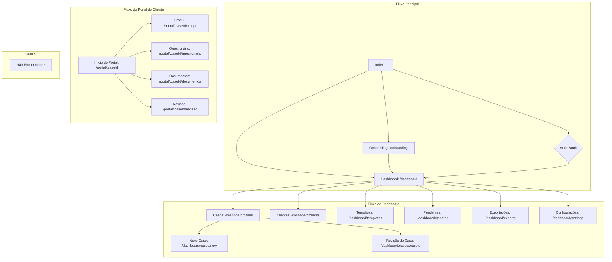

```mermaid
graph TD
    subgraph "Fluxo Principal"
        A[Index: /] --> B{Auth: /auth};
        A --> C[Onboarding: /onboarding];
        A --> D[Dashboard: /dashboard];
    end

    subgraph "Fluxo do Dashboard"
        D --> E[Casos: /dashboard/cases];
        E --> F[Novo Caso: /dashboard/cases/new];
        E --> G[Revisão do Caso: /dashboard/cases/:caseId];
        D --> H[Clientes: /dashboard/clients];
        D --> I[Templates: /dashboard/templates];
        D --> J[Pendentes: /dashboard/pending];
        D --> K[Exportações: /dashboard/exports];
        D --> L[Configurações: /dashboard/settings];
    end

    subgraph "Fluxo do Portal do Cliente"
        P[Início do Portal: /portal/:caseId] --> Q[Croqui: /portal/:caseId/croqui];
        P --> R[Questionário: /portal/:caseId/questionario];
        P --> S[Documentos: /portal/:caseId/documentos];
        P --> T[Revisão: /portal/:caseId/revisao];
    end

    subgraph "Outros"
        U[Não Encontrado: *]
    end

    C --> D;
    B --> D;
```
